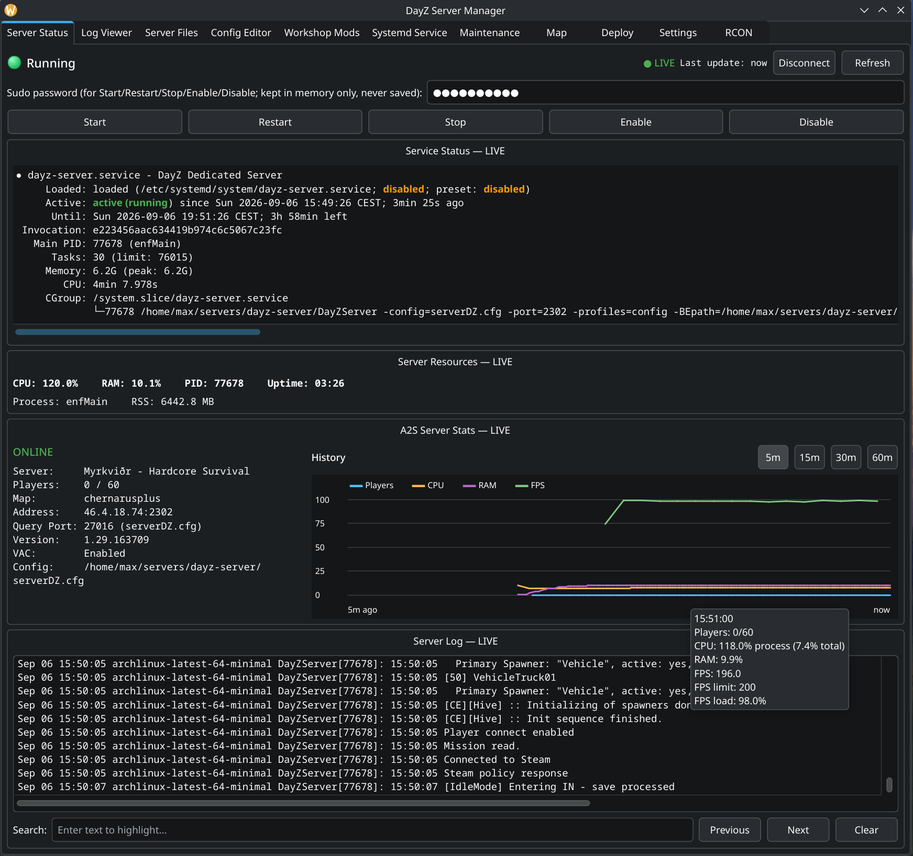

# dayz-linux-server-manager
All-in-one UI to manage Linux DayZ Servers

PySide6 application to deploy, configure and control your Linux DayZ server via SSH.
Modular design, lets you add panels if needed, handled in main.py. 101% AI slop code.

Panel Overview

Server Status
  ● Server controls to start/restart/stop
  ● Hardware usage monitor and normalized diagram
  ● A2S server information 
  ● Live server log

Log Viewer
  ● Basic log viewer with search function (detects logs for mods too)
  ● Clear logs (server and mods)

Server Files
  ● Rudimentary file browser with directory buttons for the most used ones
  ● Context menu flagging for config files and markings for wipes

Config Editor
  ● Basic editor for .xml, .cfg, .txt and .json files with syntax highlighting
  ● Search function
  ● Helper for DayZ specific configuration errors (e.g. min > nominal)

Workshop Mods
  ● Steam API key integration to browse and download mods to the server
  ● Symlink and .bisign key handling automated
  ● Manage mod priorities and export execstart params for -mod= and -servermod= 
  ● Automatic update checks for workshop files

Systemd Service
  ● Helper to set up the .service file for systemd
  ● Scheduled timers with .timer files

Maintenance
  ● Soft/Full wipe functions

Deploy
  ● Deployment and update checks for SteamCMD, stable/experimental DayZ server and systemd service file.

Settings
  ● Store paths, API keys and SSH data

RCON
  ● basic RCON interface to set up credentials, login and use commands

Installation

Clone the repository:

git clone [https://github.com/YOUR_USERNAME/YOUR_PROJECT.git](https://github.com/malinmr/dayz-linux-server-manager)
cd dayz-server-manager

Create a virtual environment:

python -m venv .venv

Activate it and install the dependencies:

pip install -r requirements.txt

Running

python main.py

Third-Party Software

This project uses PySide6, the official Qt for Python bindings.
PySide6 is available under the GNU LGPLv3 and GPLv3, subject to the applicable Qt licensing terms.
See the Qt for Python licensing documentation for more information.

Contributing

Contributions, bug reports, feature requests, and pull requests are welcome.
